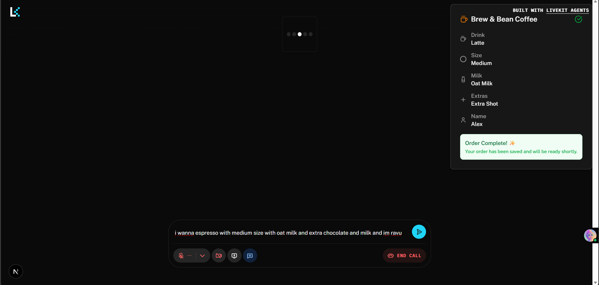

- [x] 1.  Suggest me and implement the task of  Day 2 – Coffee Shop Barista Agent

For Day 2, your primary objective is to turn the starter agent into a coffee shop barista that can take voice orders and show a neat text summary.

Primary Goal (Required)
Persona: Turn the agent into a friendly barista for a coffee brand of your choice.
Order state: Maintain a small order state object:
{
  "drinkType": "string",
  "size": "string",
  "milk": "string",
  "extras": ["string"],
  "name": "string"
}
Behavior:
The agent should ask clarifying questions until all fields in the order state are filled.
Once the order is complete, save the order to a JSON file summarizing the order.
Resources:
https://docs.livekit.io/agents/build/tools/
https://docs.livekit.io/agents/build/agents-handoffs/#passing-state
https://docs.livekit.io/agents/build/tasks/
https://github.com/livekit/agents/blob/main/examples/drive-thru/agent.py
Completing the above is enough to finish Day 2.

Advanced Challenge (Optional)
This part is completely optional and only for participants who want an extra challenge:

Build an HTML-based beverage image generation system.
The rendered HTML “drink image” should change according to the order. For example:
If the order is small, show a small cup; if large, show a larger cup.
If the drink has whipped cream, visualize it with a simple HTML shape on top of the cup.
Instead of the beverage image, you can also render an HTML order receipt.
Resources:
https://docs.livekit.io/home/client/data/text-streams/
https://docs.livekit.io/home/client/data/rpc/
Step 1: You only need the primary goal to complete Day 2; the Advanced Challenge is for going the extra mile.
Step 2: Successfully connect to the coffee shop barista in your browser and place a coffee order.
Step 3: Record a short video of your session placing a coffee order with the agent and show the JSON file summarizing the order.
Step 4: Post the video on LinkedIn with a description of what you did for the task on Day 2. Also, mention that you are building voice agent using the fastest TTS API - Murf Falcon. Mention that you are part of the “Murf AI Voice Agent Challenge” and don't forget to tag the official Murf AI handle. Also, use hashtags #MurfAIVoiceAgentsChallenge and #10DaysofAIVoiceAgents
Once your agent is running and your LinkedIn post is live, you’ve completed Day 2.

- [ ] 2. I just want the frontend to be more of the type  , i want that as i place the order the changes are also seen on the right corner as well , right now its static , the theme is great, finally when the order gets ready i want some image or animation of the coffee which i ordered 

- [x] 3.  INFO   livekit.agents   registered worker {"agent_name": "", "id": "AW_T9Ym2DjdAxYY", "url":         

                                                       "wss://voice-agent-hb52m5fu.livekit.cloud", "region":      
                                                       "India South", "protocol": 16}                             
    10:23:57 INFO   livekit.agents   received job request {"job_id": "AJ_tL9mmvmjjFEb", "dispatch_id":            
                                                          "AD_ZaDdDuYY3ZTf", "room": "voice_assistant_room_2025", 
                                                          "room_id": "RM_RU8aRZidUv6B", "agent_name": "",         
                                                          "resuming": false, "enable_recording": false}           
             DEBUG  livekit.agents   received assignment {"agent_name": "", "room_id": "RM_RU8aRZidUv6B", "room": 
                                                         "voice_assistant_room_2025", "job_id": "AJ_tL9mmvmjjFEb",
                                                         "dispatch_id": "AD_ZaDdDuYY3ZTf", "enable_recording":    
                                                         false}                                                   
             INFO   livekit.agents   initializing job runner {"tid": 15436}
             DEBUG  asyncio          Using proactor: IocpProactor  
             INFO   livekit.agents   job runner initialized {"tid": 15436, "elapsed_time": 0.42}
    10:24:01 ERROR  livekit.agents   unhandled exception while running the   {"room": "voice_assistant_room_2025"}
                                     job task                                                                     
                                     Traceback (most recent call last):                                           
                                       File                                                                       
                                     "C:\Users\ravin\Downloads\AI-VOICE-AGEN                                      
                                     T\ten-days-of-voice-agents-2025\backend                                      
                                     \.venv\Lib\site-packages\opentelemetry\                                      
                                     util\_decorator.py", line 71, in                                             
                                     async_wrapper                                                                
                                         return await func(*args, **kwargs)                                       
                                     # type: ignore                                                               
                                                ^^^^^^^^^^^^^^^^^^^^^^^^^^^                                       
                                       File                                                                       
                                     "C:\Users\ravin\Downloads\AI-VOICE-AGEN                                      
                                     T\ten-days-of-voice-agents-2025\backend                                      
                                     \.venv\Lib\site-packages\livekit\agents                                      
                                     \ipc\job_proc_lazy_main.py", line 275,                                       
                                     in _traceable_entrypoint                                                     
                                         await                                                                    
                                     self._job_entrypoint_fnc(job_ctx)                                            
                                       File                                                                       
                                     "C:\Users\ravin\Downloads\AI-VOICE-AGEN                                      
                                     T\ten-days-of-voice-agents-2025\backend                                      
                                     \src\agent.py", line 311, in entrypoint                                      
                                         agent = CoffeeShopBarista()                                              
                                       File                                                                       
                                     "C:\Users\ravin\Downloads\AI-VOICE-AGEN                                      
                                     T\ten-days-of-voice-agents-2025\backend                                      
                                     \src\agent.py", line 92, in __init__                                         
                                         self.session = None                                                      
                                         ^^^^^^^^^^^^                                                             
                                     AttributeError: property 'session' of                                        
                                     'CoffeeShopBarista' object has no                                            
                                     setter   
                                     Backend is not working help it
                                                                                                         
- [x] 4. when im texting it is giving response but when im giving ip via microphone its not working why so ? 18:08:50 INFO   livekit.agents   received {"job_i…

                                     job      "AJ_PRD…
                                     request  "dispat…
                                              "AD_LkD…
                                              "room": 
                                              "voice_…
                                              "room_i…
                                              "RM_J7k…
                                              "agent_…
                                              "",     
                                              "resumi…
                                              false,  
                                              "enable…
                                              false}  
             DEBUG  livekit.agents   received {"agent…
                                     assignme "",     
                                     nt       "room_i…
                                              "RM_J7k…
                                              "room": 
                                              "voice_…
                                              "job_id…
                                              "AJ_PRD…
                                              "dispat…
                                              "AD_LkD…
                                              "enable…
                                              false}  
             INFO   livekit.agents   initiali {"tid": 
                                     zing job 4596}   
                                     runner           
    18:08:51 DEBUG  asyncio          Using proactor:  
                                     IocpProactor     
             INFO   livekit.agents   job      {"tid": 
                                     runner   4596,   
                                     initiali "elapse…
                                     zed      0.43}   
    18:08:55 WARNI… livekit.agents   RoomInpu {"room":
                                     tOptions "voice_…
                                      and             
                                     RoomOutp         
                                     utOption         
                                     s are            
                                     deprecat         
                                     ed, use          
                                     RoomOpti         
                                     ons              
                                     instead          
             DEBUG  livekit.agents   input    {"room":
                                     stream   "voice_…
                                     attached "partic…
                                              null,   
                                              "source…
                                              "SOURCE…
                                              "accept…
                                              ["SOURC…
             DEBUG  livekit.agents   http_ses {"room":
                                     sion():  "voice_…
                                     creating         
                                     a new            
                                     httpclie         
                                     nt ctx           
    18:08:56 DEBUG  livekit.plugins… Establis {"room":
                                     hed new  "voice_…
                                     Deepgram "header…
                                     STT      {"dg-pr…
                                     WebSocke "f40ffc…
                                     t        "dg-req…
                                     connecti "f5d404…
                                     on:      "Date": 
                                              "Sun, 23
                                              Nov 2025
                                              12:38:56
                                              GMT"}}  
             DEBUG  livekit.agents   using    {"room":
                                     audio    "voice_…
                                     io:              
                                     `RoomIO`         
                                     ->               
                                     `AgentSe         
                                     ssion`           
                                     ->               
                                     `Transcr         
                                     iptSynch         
                                     ronizer`         
                                      ->              
                                     `RoomIO`         
             DEBUG  livekit.agents   using    {"room":
                                     transcri "voice_…
                                     pt io:           
                                     `AgentSe         
                                     ssion`           
                                     ->               
                                     `Transcr         
                                     iptSynch         
                                     ronizer`         
                                      ->              
                                     `RoomIO`         
    18:08:57 DEBUG  livekit.agents   start    {"room":
                                     reading  "voice_…
                                     stream   "partic…
                                              "voice_…
                                              "source…
                                              "SOURCE…
    18:09:00 INFO   livekit.agents   STT      {"room":
                                     metrics  "voice_…
                                              "model_…
                                              "nova-3…
                                              "model_…
                                              "Deepgr…
                                              "audio_…
                                              3.7}    
    18:09:05 INFO   livekit.agents   STT      {"room":
                                     metrics  "voice_…
                                              "model_…
                                              "nova-3…
                                              "model_…
                                              "Deepgr…
                                              "audio_…
                                              5.05}   
    18:09:10 INFO   livekit.agents   STT      {"room":
                                     metrics  "voice_…
                                              "model_…
                                              "nova-3…
                                              "model_…
                                              "Deepgr…
                                              "audio_…
                                              5.0}    
    18:09:15 INFO   livekit.agents   STT      {"room":
                                     metrics  "voice_…
                                              "model_…
                                              "nova-3…
                                              "model_…
                                              "Deepgr…
                                              "audio_…
                                              5.0}    
    18:09:20 INFO   livekit.agents   STT      {"room":
                                     metrics  "voice_…
                                              "model_…
                                              "nova-3…
                                              "model_…
                                              "Deepgr…
                                              "audio_…
                                              5.05}   
    18:09:25 INFO   livekit.agents   STT      {"room":
                                     metrics  "voice_…
                                              "model_…
                                              "nova-3…
                                              "model_…
                                              "Deepgr…
                                              "audio_…
                                              5.05}   
    18:09:30 INFO   livekit.agents   STT      {"room":
                                     metrics  "voice_…
                                              "model_…
                                              "nova-3…
                                              "model_…
                                              "Deepgr…
                                              "audio_…
                                              5.0}    
    18:09:35 INFO   livekit.agents   STT      {"room":
                                     metrics  "voice_…
                                              "model_…
                                              "nova-3…
                                              "model_…
                                              "Deepgr…
                                              "audio_…
                                              5.0}    
    18:09:40 INFO   livekit.agents   STT      {"room":
                                     metrics  "voice_…
                                              "model_…
                                              "nova-3…
                                              "model_…
                                              "Deepgr…
                                              "audio_…
                                              5.05}   
    18:09:45 INFO   livekit.agents   STT      {"room":
                                     metrics  "voice_…
                                              "model_…
                                              "nova-3…
                                              "model_…
                                              "Deepgr…
                                              "audio_…
                                              5.0}    
    18:09:50 INFO   livekit.agents   STT      {"room":
                                     metrics  "voice_…
                                              "model_…
                                              "nova-3…
                                              "model_…
                                              "Deepgr…
                                              "audio_…
                                              5.0}    
    18:09:55 INFO   livekit.agents   STT      {"room":
                                     metrics  "voice_…
                                              "model_…
                                              "nova-3…
                                              "model_…
                                              "Deepgr…
                                              "audio_…
                                              5.0}    
    18:10:00 INFO   livekit.agents   STT      {"room":
                                     metrics  "voice_…
                                              "model_…
                                              "nova-3…
                                              "model_…
                                              "Deepgr…
                                              "audio_…
                                              5.05}   
    18:10:05 INFO   livekit.agents   STT      {"room":
                                     metrics  "voice_…
                                              "model_…
                                              "nova-3…
                                              "model_…
                                              "Deepgr…
                                              "audio_…
                                              5.0}    
    18:10:10 INFO   livekit.agents   STT      {"room":
                                     metrics  "voice_…
                                              "model_…
                                              "nova-3…
                                              "model_…
                                              "Deepgr…
                                              "audio_…
                                              5.05}   
    18:10:15 INFO   livekit.agents   STT      {"room":
                                     metrics  "voice_…
                                              "model_…
                                              "nova-3…
                                              "model_…
                                              "Deepgr…
                                              "audio_…
                                              5.05}   
    18:10:20 INFO   livekit.agents   STT      {"room":
                                     metrics  "voice_…
                                              "model_…
                                              "nova-3…
                                              "model_…
                                              "Deepgr…
                                              "audio_…
                                              5.05}   
    18:10:25 INFO   livekit.agents   STT      {"room":
                                     metrics  "voice_…
                                              "model_…
                                              "nova-3…
                                              "model_…
                                              "Deepgr…
                                              "audio_…
                                              5.0}    
    18:10:30 INFO   livekit.agents   STT      {"room":
                                     metrics  "voice_…
                                              "model_…
                                              "nova-3…
                                              "model_…
                                              "Deepgr…
                                              "audio_…
                                              5.0}    
    18:10:35 INFO   livekit.agents   STT      {"room":
                                     metrics  "voice_…
                                              "model_…
                                              "nova-3…
                                              "model_…
                                              "Deepgr…
                                              "audio_…
                                              5.0}    
    18:10:40 INFO   livekit.agents   STT      {"room":
                                     metrics  "voice_…
                                              "model_…
                                              "nova-3…
                                              "model_…
                                              "Deepgr…
                                              "audio_…
                                              5.05}   
    18:10:45 INFO   livekit.agents   STT      {"room":
                                     metrics  "voice_…
                                              "model_…
                                              "nova-3…
                                              "model_…
                                              "Deepgr…
                                              "audio_…
                                              5.05}   
    18:10:50 INFO   livekit.agents   STT      {"room":
                                     metrics  "voice_…
                                              "model_…
                                              "nova-3…
                                              "model_…
                                              "Deepgr…
                                              "audio_…
                                              5.05}   
    18:10:55 INFO   livekit.agents   STT      {"room":
                                     metrics  "voice_…
                                              "model_…
                                              "nova-3…
                                              "model_…
                                              "Deepgr…
                                              "audio_…
                                              5.05}   
    18:11:00 INFO   livekit.agents   STT      {"room":
                                     metrics  "voice_…
                                              "model_…
                                              "nova-3…
                                              "model_…
                                              "Deepgr…
                                              "audio_…
                                              5.05}   

- [x] 4.  just implement the basic task of day3 dont go for advance topic Day 3 – Health & Wellness Voice Companion

Today you will build a health and wellness–oriented voice agent that acts as a supportive, but realistic and grounded companion.

The core idea:
Each day, the agent checks in with the user about their mood and goals, has a short conversation, and stores the results in a JSON file so it can refer back to previous days.

Primary Goal (Required)
Build a daily health & wellness voice companion that:

Uses a clear, grounded system prompt.
Conducts short daily check-ins via voice.
Persists the key data from each check-in in a JSON file.
Uses past data (from JSON) to inform the next conversation in a basic way.
Behaviour Requirements
Your agent should:

Ask about mood and energy

Example topics (but not hard-coded):
“How are you feeling today?”
“What’s your energy like?”
“Anything stressing you out right now?”
Avoid diagnosis or medical claims. This is a supportive check-in companion, not a clinician.
Ask about intentions / objectives for the day

Simple, practical goals:
“What are 1–3 things you’d like to get done today?”
“Is there anything you want to do for yourself (rest, exercise, hobbies)?”
Offer simple, realistic advice or reflections

Suggestions should be:
Small, actionable, and grounded.
Non-medical, non-diagnostic.
Examples of advice style:
Break large goals into smaller steps.
Encourage short breaks.
Offer simple grounding ideas (e.g., “take a 5-minute walk”).
Close the check-in with a brief recap

Repeat back:
Today’s mood summary.
The main 1–3 objectives.
Confirm: “Does this sound right?”
Use JSON-based persistence

After each check-in, write an entry to a JSON file from the Python backend.
On a new session:
Read the JSON file.
Provide at least one small reference to previous check-ins.
For example: “Last time we talked, you mentioned being low on energy. How does today compare?”
Data Persistence Requirements
Store data in a single JSON file (e.g., wellness_log.json).

Each session entry should at least contain:

Date/time of the check-in
Self-reported mood (text, or a simple scale)
One or more stated objectives / intentions
Optional: a short agent-generated summary sentence
You can choose the exact schema, but keep it consistent and human-readable.

Resources:
https://docs.livekit.io/agents/build/tools/
https://docs.livekit.io/agents/build/agents-handoffs/#passing-state
https://docs.livekit.io/agents/build/tasks/
https://github.com/livekit/agents/blob/main/examples/drive-thru/agent.py
If you achieve everything in this section, you have completed the Day 3 primary goal.

Advanced Goals (Optional)
The advanced goals are about:

Integrating MCP servers so the agent can manage tasks/events in real tools.
Adding slightly richer insights from the stored data.
Resources:
https://docs.livekit.io/agents/build/tools/#external-tools-and-mcp
https://github.com/livekit-examples/python-agents-examples/tree/main/mcp
https://modelcontextprotocol.io/docs/getting-started/intro
Advanced Goal 1: MCP Integration for Tasks/Notes
Connect your voice companion to an MCP server so it can create or update items in an external system when the user sets goals.

Examples (you can pick one, choose your own, or even create your own):

Notion MCP server:

Create a “Daily Wellness” database or page.
For each check-in, create a new entry with:
Date
Mood
Objectives
Optionally, mark objectives as done in follow-up sessions.
Resources:
https://developers.notion.com/docs/mcp

Todoist MCP server:

When the user states objectives like “I want to finish the project report,” turn each into a Todoist task via MCP.
Allow simple operations like:
“Mark yesterday’s goal as done.”
“Show me my tasks for today.”
Resources:
https://mcpmarket.com/server/todo-list

Zapier MCP server:

Use Zapier to fan out events:
For example, trigger a Zap that logs a summary to a Google Sheet, or sends a reminder, or schedules a google calendar event.
Requirements:

The MCP connection should be triggered from the Python backend when certain intents are detected:
Example: user explicitly says “Turn these into tasks” or “Save this to Notion.”
The agent should confirm what it did:
“I created 3 tasks in Todoist based on your goals.”
Resources:
https://zapier.com/mcp
Advanced Goal 2: Weekly Reflection Using JSON History
Use the JSON file not just as a log, but as a source for simple aggregated insights.

Examples:

Allow the user to say:
“How has my mood been this week?”
“Did I follow through on my goals most days?”
Compute basic aggregates:
Average mood score over last N days (if you store a numeric scale).
Count of days with at least one objective.
The agent should:
Summarize trends in plain language.
Keep it non-judgmental and supportive.
No complex analytics required; straightforward loops over JSON entries are enough.

Advanced Goal 3: Follow-up Reminders via MCP Tools
If you are already using an MCP server (Notion, Todoist, Zapier, etc.), extend it with simple follow-up behaviour.

Examples:

When the user mentions an important self-care activity (“I want to go for a walk at 6 pm”), offer to:
Create a reminder or event through your MCP tool.
The companion should:
Rephrase the reminder back to the user for confirmation.
Only call the MCP server after explicit confirmation.
This is mostly about wiring MCP calls to specific conversational moments.

Step 1: You only need the primary goal to complete Day 3; the Advanced Goals are for going the extra mile.
Step 2: Successfully connect to the Health & Wellness Voice Companion in your browser and have a conversation.
Step 3: Record a short video of your session with the agent and show the JSON file persisting the conversation in wellness_log.json.
Step 4: Post the video on LinkedIn with a description of what you did for the task on Day 3. Also, mention that you are building voice agent using the fastest TTS API - Murf Falcon. Mention that you are part of the “Murf AI Voice Agent Challenge” and don't forget to tag the official Murf AI handle. Also, use hashtags #MurfAIVoiceAgentsChallenge and #10DaysofAIVoiceAgents
Once your agent is running and your LinkedIn post is live, you’ve completed Day 3.

- [x] 5. Create a frontend for the Wellness Agent ans create something innovative and error free